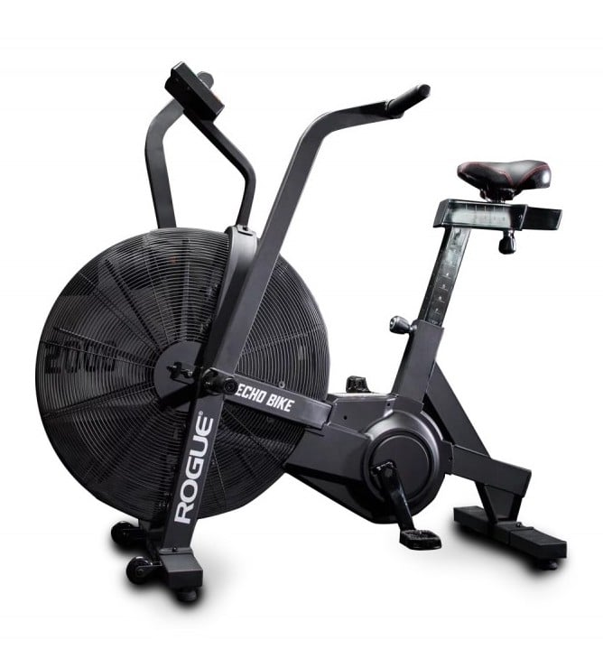
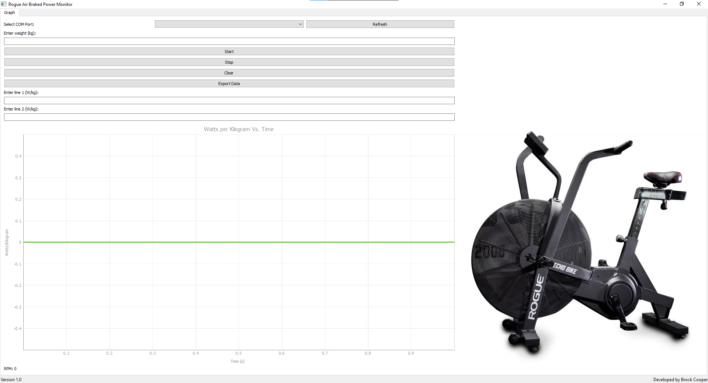
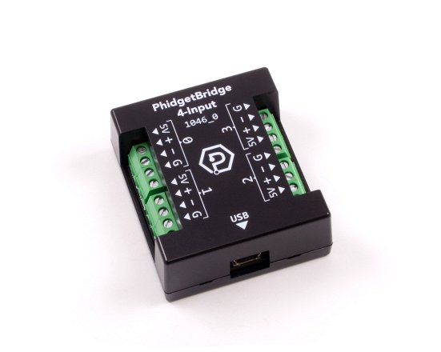

# rogue-echo (Air Braked Bike)

The Rogue Echo Bike is a popular fitness machine known for its durability and effectiveness in providing a challenging workout. It's an air resistance exercise bike designed for both high-intensity interval training (HIIT) and steady-state cardio workouts. Here's a brief description of the Rogue Echo Air Bike:

## Custom User Interface

The rogue-echo interface is a Graphical user interface (GUI) designed for working with the a Rogure Echo Air bike using the exisiting built in hall effect sensor on the fan along with a raspberry pi pico running circuit python to read the rpm of the bike at the pedals where there is a 7:1 reduction from the fan to the pedals.

## PhidgetBridge
Determining max torque required for the bike to spec the motor and gear reduction a phidget bridge with a XTRAN Load Cell was used and attached to a pedal on the bike. The `phidgetbridge.py` file records the output to an excel document stored in `output` called _force data_.

* Driver Download for '_1046_0B_' can be found [here]([https://github.com/repoockcorb/PrusaSlicer-Profiles/archive/refs/heads/main.zip](https://www.phidgets.com/?prodid=1027#Tab_User_Guide)) (User Guide > Download _64-bit Installer Download_) 

# requirements.txt

odrive==0.6.7
pyinstaller==5.13.0
pyqtgraph==0.13.3
PyQt5==5.15.9
numpy==1.25.1
matplotlib==3.7.2
openpyxl==3.1.2
pyserial==3.5
thonny==4.1.3
Phidget22==1.17.20231004
pandas==2.1.1
